# Projeto de Interface

A **interface** do Agendify foi projetada para oferecer uma experiência intuitiva e eficiente na gestão de reservas em condomínios, coworkings e demais ambientes compartilhados. Cada tela foi desenvolvida para garantir usabilidade, clareza e acessibilidade, atendendo às necessidades dos usuários de forma prática e organizada. O projeto se apoia na norma técnica de qualidade de software **ISO/IEC 25010:2023**, buscando altos padrões de usabilidade, eficiência e confiabilidade.

O **painel administrativo (web)** já está **implementado** em **Next.js 16 / React 19**, seguindo o [Design System](DESIGN-SYSTEM.md), com **acessibilidade WCAG 2.2 AA**, **responsivo** (desktop, tablet e mobile) e **tema claro/escuro**.

As diretrizes de identidade visual (logo, paleta, tipografia) estão em [Design System](DESIGN-SYSTEM.md).

## Diagramas de fluxo

<h4 align="center">Fluxo do Administrador</h4>

 

<h4 align="center">Fluxo do Usuário</h4>

## Telas do Painel Administrativo (implementadas)

Telas reais do painel de gestão (perfil **Administrador**), na identidade final da marca. Todos os componentes seguem o mesmo design system tokenizado — os mesmos tokens trocam de valor entre os temas **claro** e **escuro**.

### Login
Acesso do gestor com e-mail e senha, com o lockup da marca e formulário acessível.

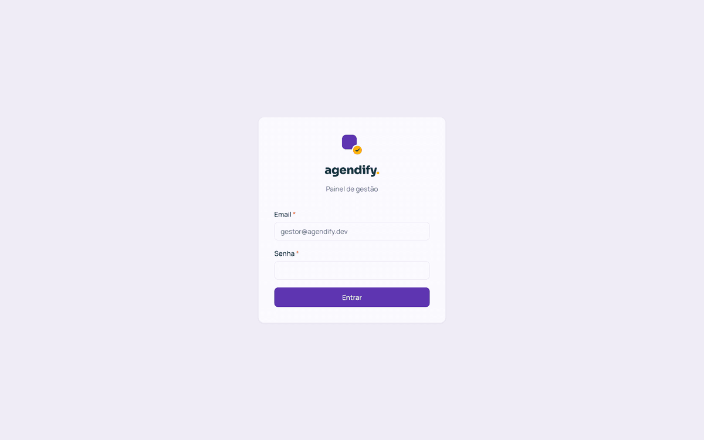

 

### Visão geral (Dashboard)
Resumo com KPIs (espaços, disponíveis, reservas totais e futuras) e a lista de reservas recentes.

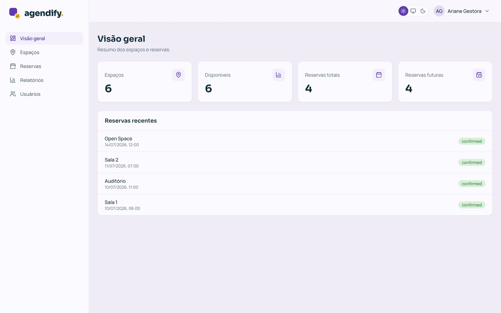

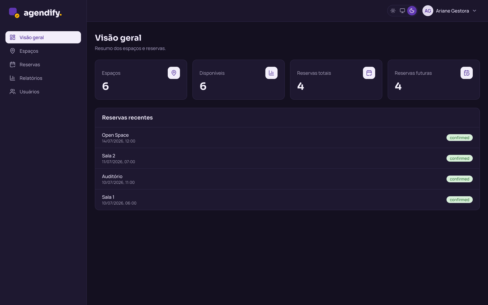

<h4 align="center">Tema claro e escuro</h4>

 

### Espaços
Listagem dos espaços reserváveis com status, e criação/edição em modal (nome, capacidade, horários, imagem e disponibilidade).

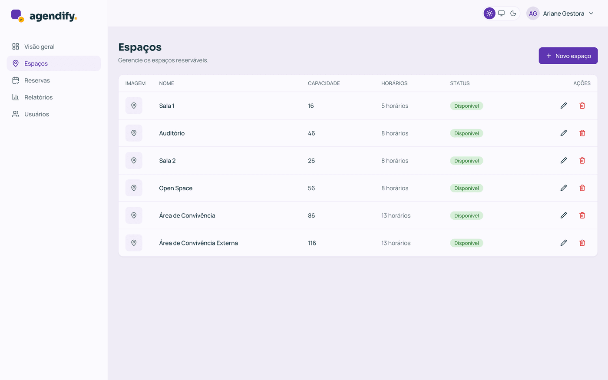

 

### Reservas
Acompanhamento e criação de reservas; conflitos de horário (RN-01) são destacados em coral no formulário.

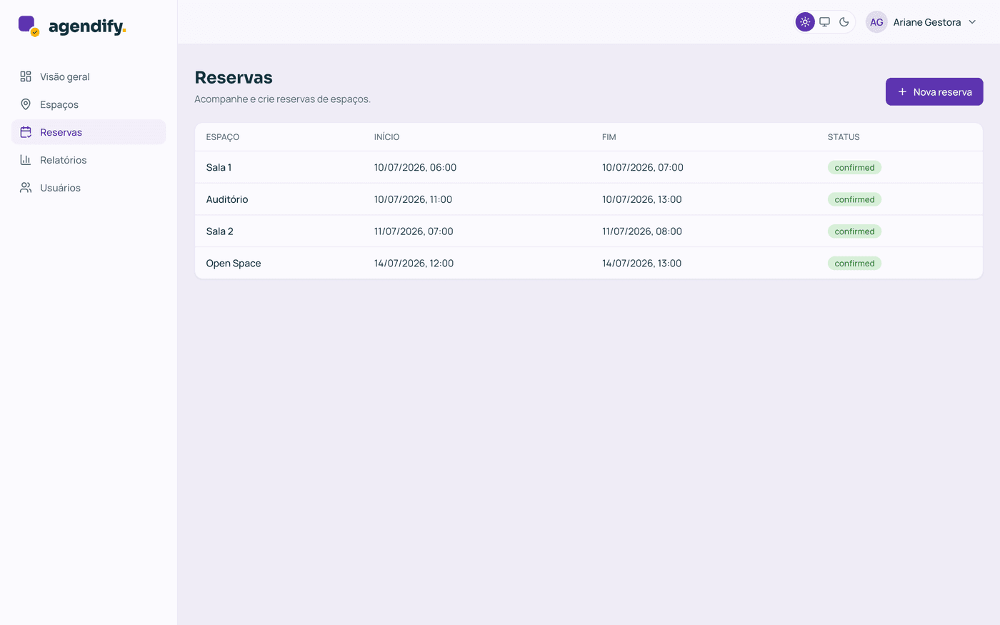

 

### Relatórios de ocupação
Horários de pico por espaço, com filtro por ano/mês.

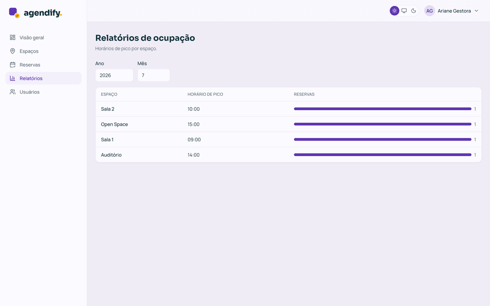

 

### Usuários
Gestão de acessos ao sistema (criar, editar e excluir), com salvaguardas de perfil (o gestor não exclui a si mesmo nem altera o próprio perfil).

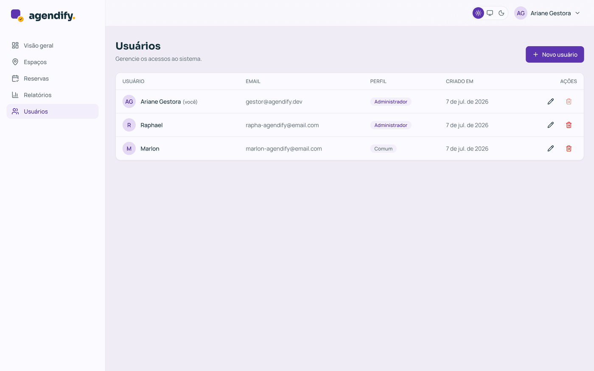

 

### Navegação mobile
Abaixo de `lg`, a barra lateral vira um **drawer** acessível, aberto por um botão hambúrguer.

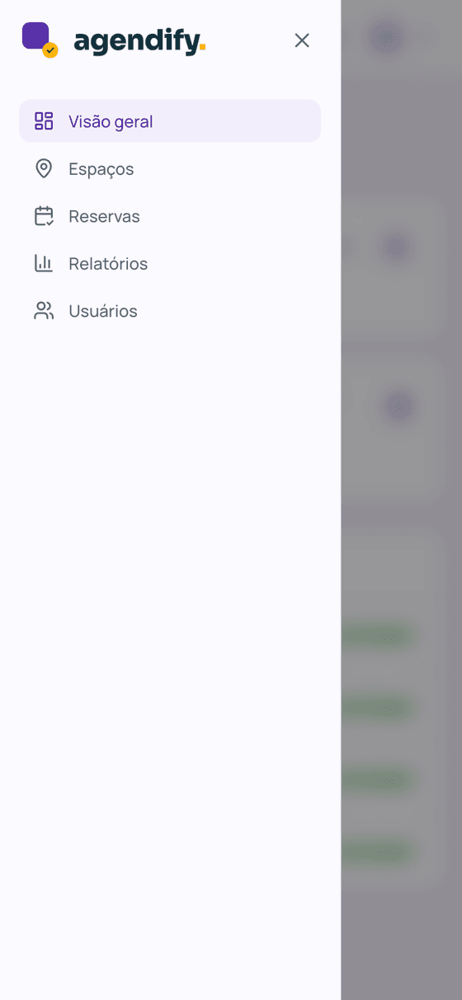

## Telas do App Mobile (implementadas)

O aplicativo (Expo / React Native — perfil **Member** dentro de um *tenant*) segue o **mesmo design
system** do painel: marca `#5E35B1`, fontes **Sora/Manrope** e os **mesmos tokens** que trocam de
valor entre os temas **claro** e **escuro**. A experiência é acessível (papéis, rótulos e estados
de acessibilidade, alvos de toque ≥ 44 px, *Dynamic Type*) e responsiva (safe area por *insets*,
breakpoints para tablet/landscape, listas virtualizadas).

### Login
Autenticação por e-mail e senha, com o lockup da marca; quem recebeu um convite por *deep link*
(`agendify://accept-invite?token=…`) ativa a conta na tela de aceite.

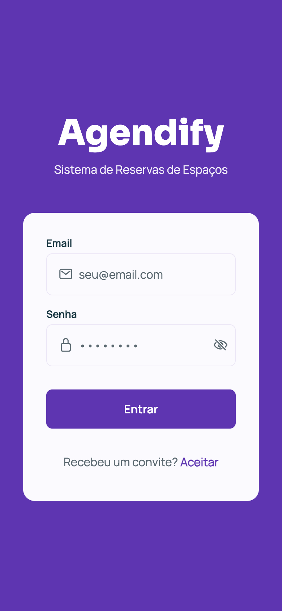

 

### Início (Dashboard)
Saudação, atalhos para reservas e espaços e os dados da conta, personalizados por papel
(Member × admin do *tenant*).

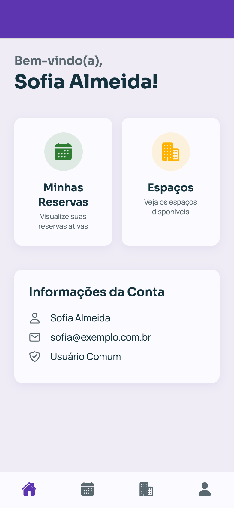

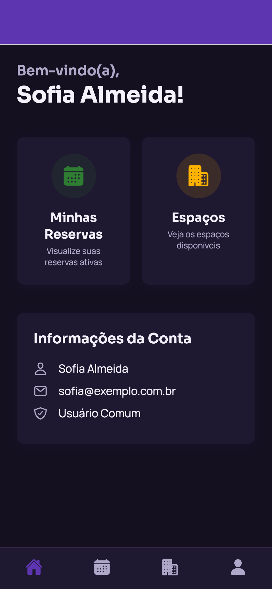

<h4 align="center">Tema claro e escuro</h4>

 

### Espaços
Catálogo reservável com imagem, status e capacidade; grade adaptativa (1 coluna no celular,
2 no tablet), com ações de reservar e de ver avaliações. Administradores do *tenant* também
criam e editam espaços por aqui.

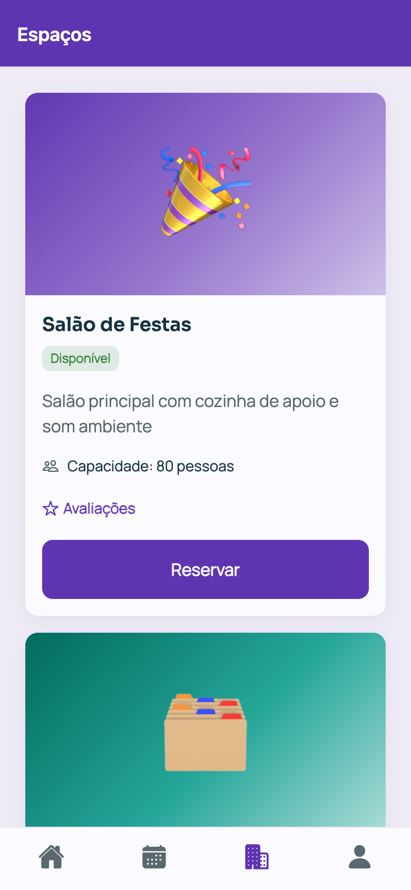

 

### Reservas
Criação, edição e cancelamento, com filtro por data e seleção de horários que respeita a regra
de conflito (RN-01).

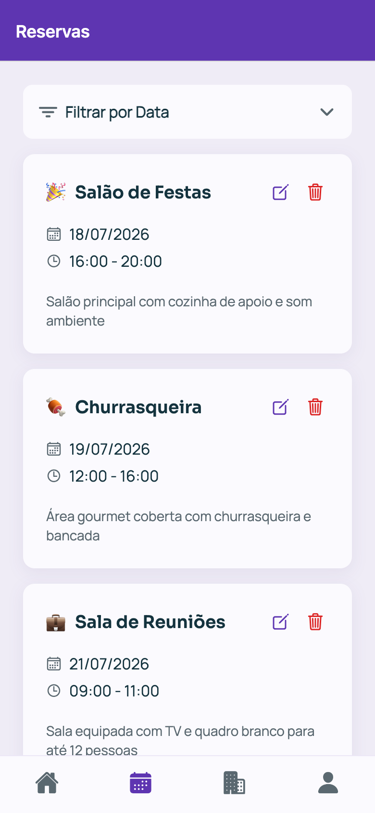

 

### Avaliações do espaço
Nota por estrelas + comentário (RF-013), com listagem e média por espaço.

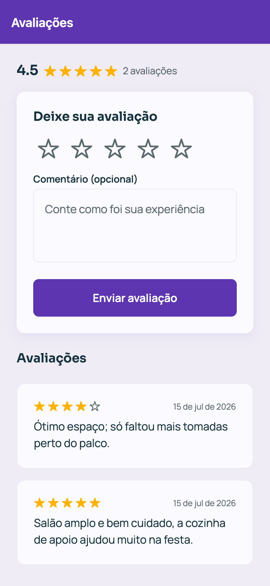

 

### Perfil
Dados do usuário, edição de perfil, troca de senha e alternância de tema (claro / sistema / escuro).

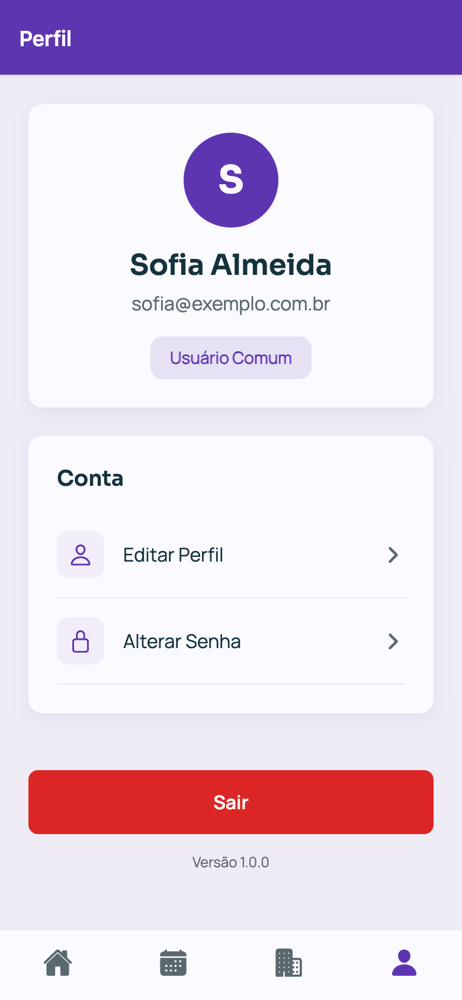

 

### Usuários
Gestão de acessos do *tenant*, visível apenas para administradores.

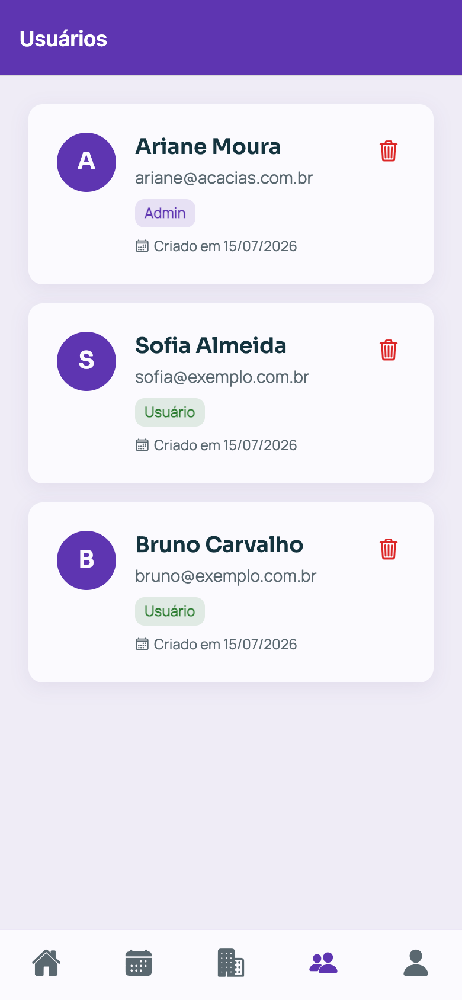

> Nota: a **recuperação de senha (RF-003)** ainda não está disponível no app — ver
> [Especificação → Requisitos](02-Especificação%20do%20Projeto.md) e o [Roadmap](../ROADMAP.md).
