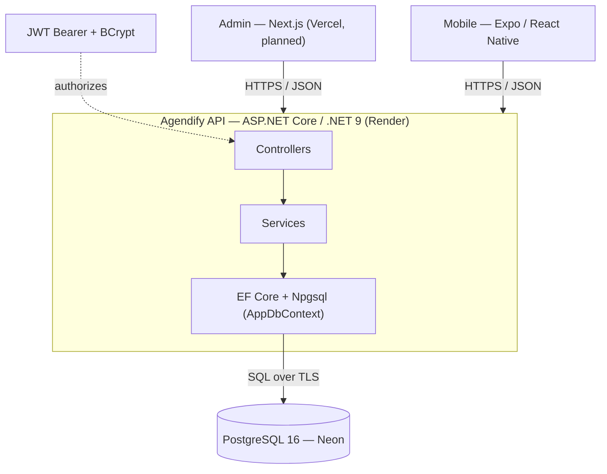

# Architecture

Technical reference for the Agendify backend. For decision rationale, see the
[ADRs](adr/); for the entry point, see the [root README](../README.md).

## 1. System context

One backend is the single source of truth; web and mobile clients consume the same REST API.



## 2. Layered design

The API uses a pragmatic layered architecture with clear seams. Controllers are thin;
business rules live in services; persistence is isolated in the `AppDbContext`.

| Layer | Responsibility | Representative types |
| :--- | :--- | :--- |
| Controllers | HTTP surface: routing, `[Authorize]`, status codes | `BookingsController`, `SpacesController`, `AuthController` (`/api/*`) |
| Services (scoped) | Business rules and orchestration | `BookingsService`, `AuthService`, `PrivacyService`, `IdempotencyService`, `SpacesService`, `ReviewsService`, `AnalyticsService`, `UsersService`, `ResourcesService` |
| Data | EF Core persistence; entities map to `snake_case` tables | `AppDbContext`, `Migrations/` |
| Cross-cutting | Config binding, JWT validation, CORS, domain exceptions | `DatabaseSettings`, `JwtSettings`, `BookingConflictException` |

Supporting patterns: **DTOs** for request shaping (e.g. `SpaceFormRequest` for multipart
uploads), **custom domain exceptions** translated to HTTP status at the controller boundary,
and **dependency injection** throughout (`Program.cs`).

## 3. Request pipeline

Middleware order in `src/api/Program.cs` (execution order):

1. Migrations on startup — `Database.Migrate()` when `IsDevelopment()` or `ApplyMigrationsOnStartup=true`.
2. `GET /status` — liveness timestamp.
3. Swagger UI — **Development only**.
4. `UseHttpsRedirection`.
5. `UseCors("AllowWebApp")` — dev origins plus `CORS_ALLOWED_ORIGINS` (comma-separated).
6. Static files for `/uploads`.
7. `UseAuthentication` → `UseAuthorization`.
8. `MapControllers`.

Authentication is JWT Bearer (validates issuer, audience, lifetime, signing key).
Authorization uses roles (`Administrator`, `Common`) and an `AdminOnly` policy.

## 4. Core write path — a booking under contention

`POST /api/bookings` shows the core write path: the invariant is enforced by the database and
surfaced as an HTTP status.

```mermaid
sequenceDiagram
    participant U as Client
    participant C as BookingsController
    participant S as BookingsService
    participant DB as PostgreSQL
    U->>C: POST /api/bookings (Bearer JWT)
    Note over C: [Authorize] validates JWT; userId from token claims
    C->>S: Create(booking)
    S->>S: ValidateSpaceRulesAsync (friendly checks)
    S->>DB: INSERT booking (SaveChanges)
    alt slot is free
        DB-->>S: OK
        S-->>C: created
        C-->>U: 201 Created
    else overlap with a confirmed booking
        DB-->>S: 23P01 exclusion_violation
        S-->>C: throw BookingConflictException
        C-->>U: 409 Conflict
    end
```

**Idempotency.** `POST /api/bookings` honors an `Idempotency-Key` header: a replay with the
same key returns the original response instead of creating a duplicate (backed by the
`idempotency_keys` table).

## 5. Data model

PostgreSQL 16 via EF Core migrations (`InitialCreate`, `AddAuthAndLgpd`). Relationships are
modeled through string foreign-key columns (no navigation properties).

| Table | Purpose |
| :--- | :--- |
| `users` | Accounts; unique email; `profile` (role); `anonymized_at` for LGPD tombstoning |
| `spaces` | Bookable spaces; `available_hours` as `text[]`; embedded `resources` as `jsonb` |
| `resources` | Space amenities (projector, A/C, …) |
| `bookings` | Links user + space + time range; carries the anti-overlap constraint |
| `refresh_tokens` | Hashed long-lived tokens for JWT renewal |
| `idempotency_keys` | Composite PK `(key, user_id)` — dedupes retried writes |
| `consents`, `audit_logs` | LGPD: consent ledger and audit trail |
| `reviews` | Space ratings |

**Why string FK columns and no navigation properties.** The schema deliberately keeps plain
`text` foreign-key columns (`user_id`, `space_id`) without EF Core navigation properties or
database-level FK constraints. This is a pragmatic carry-over from the document-store origin: it
minimized the migration surface, keeps writes simple (no cascade semantics to reason about), and
makes the service layer's joins explicit — `BookingsService` composes `BookingWithUserAndSpace`
by loading the related rows itself. The trade-off is that referential integrity is not
engine-enforced (an orphaned `user_id` is possible), which the services must respect; adding FK
constraints is a low-risk future hardening step.

## 6. The concurrency invariant (RN-01)

The product's critical rule — no two confirmed bookings overlap in the same space — lives in
the database as an atomic exclusion constraint, not in application code. See
[ADR-0002](adr/0002-db-enforced-invariant.md).

```sql
CREATE EXTENSION IF NOT EXISTS btree_gist;

ALTER TABLE bookings
  ADD COLUMN during tstzrange
  GENERATED ALWAYS AS (tstzrange(start_date_time, end_date_time, '[)')) STORED;

ALTER TABLE bookings
  ADD CONSTRAINT no_overlap
  EXCLUDE USING gist (space_id WITH =, during WITH &&)
  WHERE (status = 'confirmed');
```

- `'[)'` is a **half-open** interval: back-to-back bookings do not collide.
- `WHERE (status = 'confirmed')` means only confirmed bookings arbitrate a slot.
- A violation raises SQLSTATE **`23P01`**, caught in `BookingsService` and re-thrown as
  `BookingConflictException` → HTTP 409. This is atomic and immune to the check-then-insert
  **TOCTOU** race, verified by a 100-way concurrency test (see [TESTING.md](TESTING.md)).

### Edge cases

Beyond the basic race, two higher-order scenarios shape the design:

- **Concurrent cancel + waitlist release (planned, RF-017).** If a cancellation frees a slot at
  the instant another user and an automatic waitlist offer both try to claim it, the same
  `no_overlap` constraint arbitrates: whoever inserts the confirmed booking first wins; the others
  get 409 and fall through to the next in line. The cancellation and its `SlotReleased` event
  should be written in one transaction (outbox, §9) so no slot is silently lost or double-granted.
- **Partial failure / dual-write and DST.** A booking may commit while a downstream notification
  or payment fails, or a reservation may cross a daylight-saving transition. Timestamps are stored
  in **UTC** (the code forces `DateTimeKind.Utc`), so the stored range is unambiguous; a slot key
  is computed in the space's timezone to avoid double-counting across DST. Reliable notification
  without phantom or duplicate bookings is a job for the outbox pattern plus idempotency (§9).

## 7. Configuration & secrets

Config resolves `appsettings.json` → `appsettings.{Environment}.json` → **User Secrets**
(dev) → **environment variables** (prod). Two fail-fast guards in `Program.cs` abort boot if
the DB connection string is empty or `JwtSettings:Secret` is shorter than 32 characters.
Settings classes: `DatabaseSettings`, `JwtSettings`.

## 8. Error handling & observability (current state)

See the [Roadmap](../ROADMAP.md) for planned hardening.

- **Error handling:** per-controller `try/catch` (no global exception middleware yet).
  `BookingsController` maps `BookingConflictException` → 409 and `InvalidOperationException`
  → 400.
- **Logging:** default `Microsoft.Extensions.Logging` only (no structured logging).
- **Health:** a single `GET /status` timestamp (no DB probe).

Planned: RFC 7807 `ProblemDetails` via a global `IExceptionHandler`, structured logging with
correlation IDs, real health checks with a Npgsql probe, and OpenTelemetry.

## 9. Communication & real-time (design rationale)

Only REST is implemented today; the rest are forward-looking design notes.

- **REST/HTTPS + JSON (implemented).** The domain is resource-oriented (`bookings`, `spaces`,
  `users`); request/response semantics fit, tooling is mature, and responses are cacheable. Writes
  accept an `Idempotency-Key` (implemented); errors return `409` for booking conflicts. API
  versioning under `/api/v1` and publishing the OpenAPI as an artifact are planned (RNF-018).
- **SignalR for real-time (planned, RF-008/RF-020).** Availability is inherently multi-user and
  must propagate live; polling wastes bandwidth and goes stale. SignalR is the native .NET
  bidirectional transport with automatic fallback (WebSocket → SSE → long-polling) and a React
  Native client. Servers would publish `SlotReserved`/`SlotReleased` to per-space groups; clients
  update their React Query cache and degrade gracefully to light polling on socket loss (RNF-020).
- **gRPC — internal only (future).** Justified for service-to-service calls (e.g. a future
  notifications microservice) via protobuf/HTTP-2 — not for the mobile edge, where gRPC-web/React
  Native support is weaker and booking payloads are small.
- **GraphQL — out of scope.** Client queries are not heterogeneous enough to justify the added
  complexity; REST plus a few aggregation endpoints suffices.
- **Outbox pattern (planned).** Writing a domain event to an `outbox` table inside the same
  transaction as the booking, then publishing it at-least-once from a background worker, removes
  the dual-write inconsistency between persisting a booking and notifying/releasing a slot. For
  the current solo MVP, direct send with retry is adequate; the outbox arrives with payments or
  external integrations.

## 10. Quality attributes (ISO/IEC 25010)

Prioritized quality subcharacteristics and how the system addresses them (the concrete
non-functional requirements are catalogued in
[02-Especificação](02-Especificação%20do%20Projeto.md)):

- **Functional suitability** — completeness (full booking/management flows) and correctness
  (availability, conflicts, and rules processed exactly, including under concurrency).
- **Security** — confidentiality/integrity of personal and booking data; authenticity (every
  action tied to an authenticated user, supporting audit). See [SECURITY.md](../SECURITY.md).
- **Reliability** — maturity (rigorous integration tests), availability, fault tolerance.
- **Usability** — learnability, operability, accessibility across web and mobile.
- **Performance efficiency** — response time and resource use (targets RNF-005…010).
- **Maintainability** — modularity, reusability, analysability (layered architecture, SOLID).
- **Portability** — adaptability across devices/OSes and installability.

Tracking metrics: user-satisfaction index (reviews), error/failure rate, mean response time,
MTBF, usability index (SUS), security incidents, MTTR, resource use, accessibility rate.

## Related

- [ADRs](adr/) — decision records
- [Testing](TESTING.md) · [CI/CD](CICD.md) · [Deployment](DEPLOYMENT.md)
