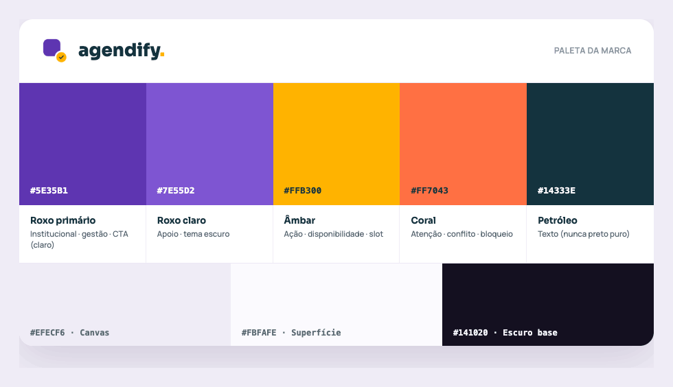

# Design System

Brand foundations for Agendify — the source of truth for logo, colour, and typography across
web and mobile, feeding the frontend redesign.

## Brand concept

The name **Agendify** fuses "Agenda" with the suffix "-ify" — the act of organizing, scheduling,
and simplifying. The mark is a stylized **calendar** in clean, modern lines (organization,
planning, time), shaped as an app icon for visual consistency between web and mobile. Its focal
point is the **yellow check (✓)** at the centre: confirmation, success, and the feeling of
"It's booked!".

## Brand palette

| Token | Hex | Usage |
| :--- | :--- | :--- |
| Roxo primário | `#5E35B1` | Primary · brand · CTA (light) |
| Roxo claro | `#7E55D2` | Support · dark-theme accent |
| Âmbar | `#FFB300` | Action · availability · slot |
| Coral | `#FF7043` | Attention · conflict · blocked |
| Petróleo | `#14333E` | Text (never pure black) |
| Canvas | `#EFECF6` | Background |
| Superfície | `#FBFAFE` | Surface |
| Escuro base | `#141020` | Dark base |

### Colour psychology & purpose

- **Purple (primary).** Modernity, creativity, and trust; a professional, sophisticated tone
  appropriate to a management platform. It carries the brand identity and unifies web and app.
- **Amber / coral (accent).** Warm colours for calls-to-action, alerts, and confirmations. Amber
  signals optimism, attention, and success (the "check!"); coral adds energy and flags conflict
  or a blocked slot. Amber guides the user toward confirm buttons and selected dates.
- **Neutrals (Canvas / Surface / Petróleo).** Light grounds for contrast and legibility; text
  uses Petróleo `#14333E` rather than pure black to soften the page while keeping AA contrast.

The balance between the cool purple and the warm amber/coral yields an interface that is at once
serious and inviting.

## Typography

- **Opun Mai** — section titles and subtitles. A display face with personality that stays legible;
  it builds visual hierarchy and reinforces the modern identity.
- **Oleo Script** — brand signature and large hero titles. A friendly, fluid script that adds a
  human touch and echoes the "simplicity" value. Use sparingly, for brand moments only.
- **Inter** — body copy, descriptions, and UI. Designed for screens, it offers excellent
  legibility across sizes and platforms; it is the default for all running text.

## Logo usage

Logo lockups (light/dark, horizontal/vertical) live in `docs/img/`. Use the dark-text lockup on
Canvas/Surface and the light lockup on Escuro base. Keep clear space around the mark equal to the
height of the check badge.

## Related

- [Projeto de Interface](04-Projeto%20de%20Interface.md) — wireframes and flows that apply this system.
